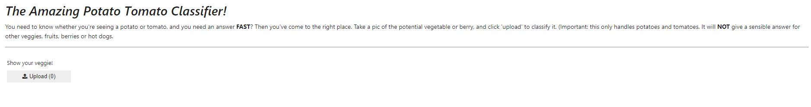

# Potato-tomato classifier
It's a basic classifier trained with ResNet18 on pictures obtained using Bing Search API. It was inspired by and heavily based on fast.ai lessons (available here: https://course.fast.ai) and the book "Deep Learning for Coders with Fastai and PyTorch: AI Applications Without a PhD", which you can [buy](https://www.amazon.com/Deep-Learning-Coders-fastai-PyTorch/dp/1492045527) or read as interactive Jupyter Notebooks for free.

In order to "play" with the potato-tomato classifier, you can:
- use the notebook (you will have to download the export.pkl file and then uncomment the commented lines and run it all)
- use this [link](https://mybinder.org/v2/gh/GJuceviciute/potatotomato-classifier/HEAD?urlpath=%2Fvoila%2Frender%2FPotato_tomato_classifier.ipynb) to launch the notebook as an app (be patient, it takes a while). Once it's ready, it should look like this: 
- if the link above fails, you can manually deploy and use the notebook as an app (for free) using Binder
  1. go to https://mybinder.org
  2. write GJuceviciute/potatotomato-classifier under **GitHub repository name or URL**
  3. choose **URL** under **Path to a notebook file** (it will change from **Path to a notebook file** to **URL to open**)
  4. write /voila/render/Potato_tomato_classifier.ipynb under the **URL to open** 
  5. Press ***launch*** and wait
  6. Follow the instructions there, i.e., upload a picture, and wait for the *magic* - prediction results
 
