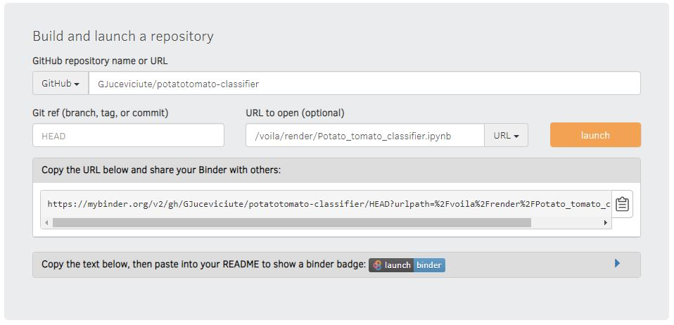

# Potato-tomato classifier
It's a basic classifier trained with resnet 18 on pictures obtained using Bing Search API. It was inspired by and heavily based on fastai lessons (available here: https://course.fast.ai) and book "Deep Learning for Coders with Fastai and PyTorch: AI Applications Without a PhD" which you can buy or read as interactive Jupyter Notebooks for free.

In order to "play" with the potato-tomato classifier, you can:
- use the notebook (you will have to download the export.pkl file and then uncomment the commented lines and run it all)
- deploy and use it as an app (for free) using Binder
  1. go to https://mybinder.org
  2. write GJuceviciute/potatotomato-classifier under **GitHub repository name or URL**
  3. choose **URL** under **Path to a notebook file** (it will change from **Path to a notebook file** to **URL to open**)
  4. write /voila/render/Potato_tomato_classifier.ipynb under the **URL to open** 
  5. Press ***launch*** and wait
  6. Follow the instructions there, i.e., upload a picture, and wait for the *magic* - prediction results
 
